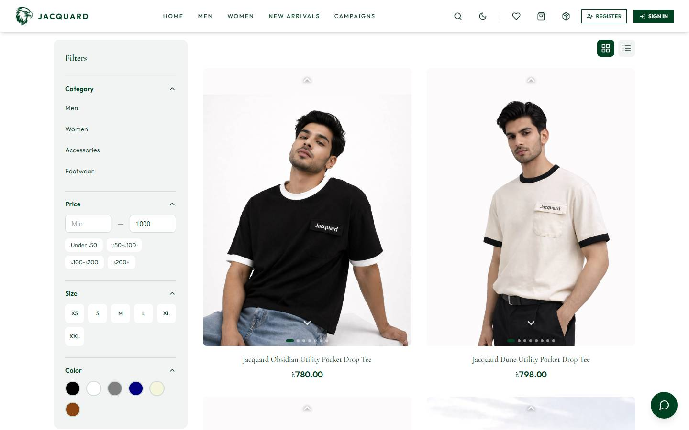
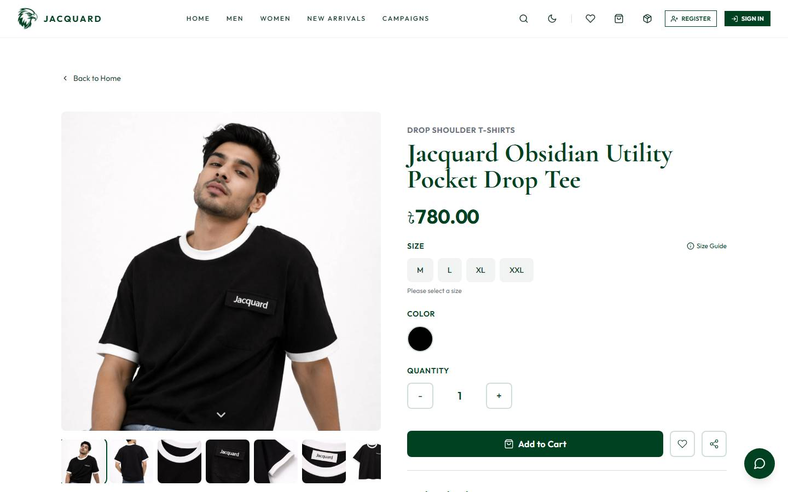
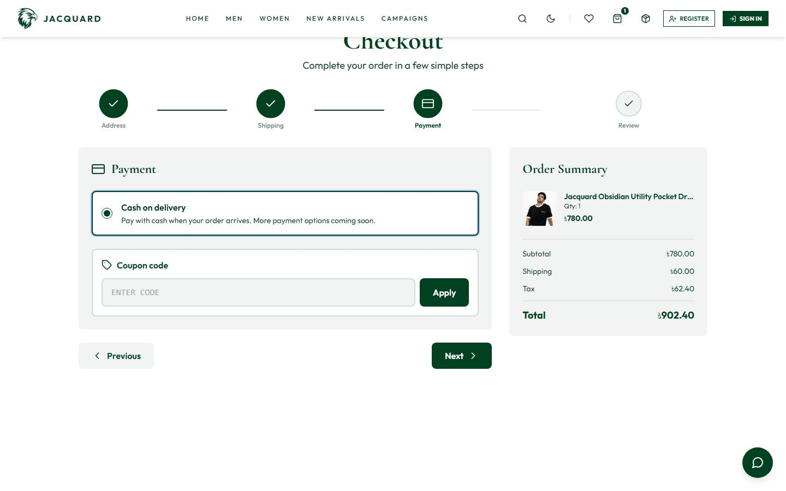

# Jacquard

Jacquard is a menswear and womenswear shop. The storefront is live at [jacquardbd.com](https://jacquardbd.com). Shoppers browse collections, open a product, and check out as a guest or with an account. Signed-in customers can also spend reward points, and the store can offer coupon codes that come off the order before tax.

## Storefront

The homepage leads with the current campaign photo, then new arrivals, department edits, and best sellers.

New arrivals, Men, and Women share the same catalog: filters for category, price, size, and color, plus sort. Each card shows the piece, the name, and the price in taka.

A product page is where the size and color are chosen. The gallery, price, quantity, and add-to-cart sit on one screen, with the size guide linked beside the size picker.

## Checkout

Checkout is four steps: address, shipping, payment, and review. Payment is cash on delivery. The summary on the right keeps the line items, shipping, tax, and total in view the whole way.

### Coupons

Admins create codes at `/admin/coupons`. A code can be a percentage or a fixed amount in taka, with a start and end date, a minimum order, an optional product list, and a cap on how many times it can be used.

Customers type the code on the payment step. The discount is taken from the eligible subtotal, and tax is calculated on what remains. The server checks the code again when the order is created, so a code that fails validation never lands on the order.

Codes live in the MongoDB `coupons` collection. A completed order stores `couponCode` and `couponDiscount`.

### Reward points

Points are for signed-in customers. Guests can still place an order, and the coupon field stays available to them, but the reward block is hidden until someone is logged in.

Earn rate: **1 point for every ৳100** of merchandise, counted on the subtotal after any coupon and before any reward discount.

Customers see their balance at `/account/reward-points`. Each offer is a rule from `/admin/reward-rules`: a point cost, then either a percent off, a fixed taka amount, or free shipping. A rule can require a minimum subtotal and can be limited to specific products. From the account page, **Redeem for next order** holds that offer as a pending reward and spends the points immediately. At checkout, a signed-in customer can apply that saved reward or pick another offer their balance can cover.

Admins can also set a customer’s balance directly from **Customers**.

Rules live in `rewardrules`. A user document holds `rewardPoints` and, when something is saved for later, `pendingReward`. The order records `rewardDiscount`, `rewardFreeShipping`, and `pointsEarned`.
